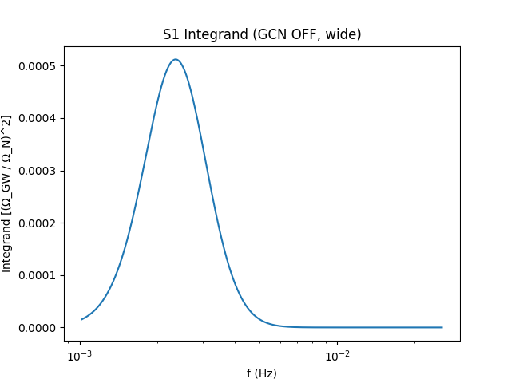
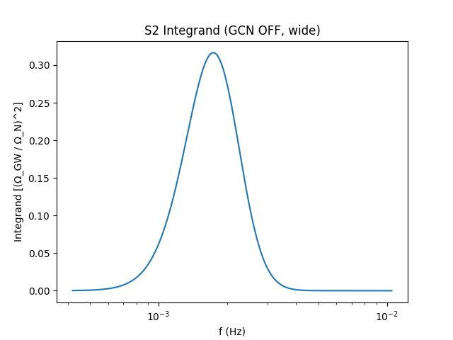

# PTTEM: SNR pipeline and figures

[](https://doi.org/10.5281/zenodo.17357409)
[](https://doi.org/10.5281/zenodo.8475)
[](./LICENSE)

## Overview
Minimal runner to compute LISA-band SNR from benchmark SGWB spectra and save diagnostic plots.

## Installation
```bash
python -m venv .venv
# Windows
.venv\Scripts\activate
pip install -r requirements.txt
# Conservative baseline
python src/snr_test.py --gcn on  --band standard
# Optimistic, wider band
python src/snr_test.py --gcn off --band wide
Artifacts:

JSON: output.json

Plots: figs/*.png

Expected results (sanity)

LISA single-TDI, 4 yr, R_Ω=0.03.

Typical SNR ranges:

S1: ~5 (GCN ON, standard)

S2: ~16 (GCN ON, standard)

OFF+wide gives larger SNR as documented in the paper.
If values are far off, check Python/NumPy versions and that figs/ exists.

Reproducibility

Deterministic given the fixed grids. No random seeds used.

Integration uses NumPy trapezoid on a log-frequency grid.

Data and Code Availability

Preprint, data and figures: https://doi.org/10.5281/zenodo.17357409

Stand-alone script archive: https://doi.org/10.5281/zenodo.8475

How to Cite
Preprint
@misc{Ozyurt_PTTEM_2025_preprint,
  author = {Özyurt, Emre},
  title  = {Stochastic Gravitational-Wave Signatures of Dark-Matter Phase Transitions:
            A Thermodynamic Buffer Mechanism for Self-Regulating Cosmic Expansion},
  year   = {2025},
  doi    = {10.5281/zenodo.17357409}
}

Software
@software{Ozyurt_snrtest_2025,
  author = {Özyurt, Emre},
  title  = {PTTEM: snr\_test.py},
  year   = {2025},
  doi    = {10.5281/zenodo.8475}
}

License

MIT; see LICENSE.


# CITATION.cff
```yaml
cff-version: 1.2.0
title: "PTTEM: SNR pipeline, data and figures"
message: "If you use this work, please cite the paper and the software."
type: software
version: "v10.1"
authors:
  - family-names: "Özyurt"
    given-names: "Emre"
repository-code: "https://github.com/ozyurte/PTTEM"
doi: 10.5281/zenodo.8475
identifiers:
  - type: doi
    value: 10.5281/zenodo.17357409
  - type: doi
    value: 10.5281/zenodo.8475
preferred-citation:
  type: article
  title: "Stochastic Gravitational-Wave Signatures of Dark-Matter Phase Transitions"
  authors:
    - family-names: "Özyurt"
      given-names: "Emre"
  year: 2025
  doi: 10.5281/zenodo.17357409

LICENSE (MIT)
MIT License

Copyright (c) 2025 Emre Özyurt

Permission is hereby granted, free of charge, to any person obtaining a copy
of this software and associated documentation files (the “Software”), to deal
in the Software without restriction, including without limitation the rights
to use, copy, modify, merge, publish, distribute, sublicense, and/or sell
copies of the Software, and to permit persons to whom the Software is
furnished to do so, subject to the following conditions:

The above copyright notice and this permission notice shall be included in
all copies or substantial portions of the Software.

THE SOFTWARE IS PROVIDED “AS IS”, WITHOUT WARRANTY OF ANY KIND, EXPRESS OR
IMPLIED, INCLUDING BUT NOT LIMITED TO THE WARRANTIES OF MERCHANTABILITY,
FITNESS FOR A PARTICULAR PURPOSE AND NONINFRINGEMENT. IN NO EVENT SHALL THE
AUTHORS OR COPYRIGHT HOLDERS BE LIABLE FOR ANY CLAIM, DAMAGES OR OTHER
LIABILITY, WHETHER IN AN ACTION OF CONTRACT, TORT OR OTHERWISE, ARISING FROM,
OUT OF OR IN CONNECTION WITH THE SOFTWARE OR THE USE OR OTHER DEALINGS IN
THE SOFTWARE.

Komutlar
cd ~/PTTEM
# README + CITATION + LICENSE ekle
git add README.md CITATION.cff LICENSE
git commit -m "Docs: README with DOI badges, CITATION.cff, MIT license"
git push
 
